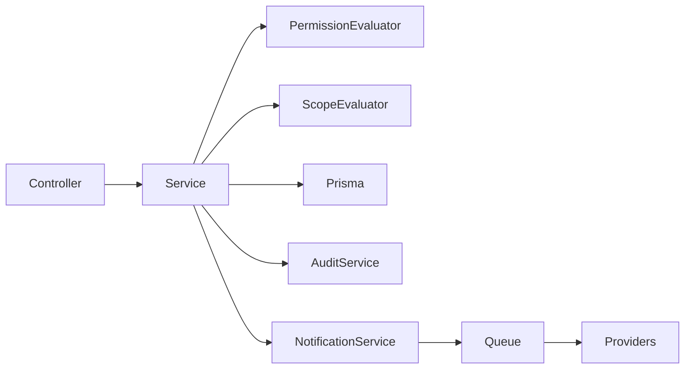

# Component Design

## 1. Component Overview

Components are organized by business module. Each module owns its controller/API surface, DTO validation and application services.

Avoid creating one generic framework that hides business rules.

---

## 2. Frontend Components

### Platform Admin
- InstitutionList
- InstitutionForm
- InstitutionStatusActions
- InstructorList
- InstructorForm
- PlatformCourseManager

### Institution Management
- StudentTable
- StudentDetails
- StudentImport
- StaffManagement
- AcademicYearManager
- GradeSectionManager
- SubjectGroupManager
- AttendanceSheet
- HomeworkForm
- ExamForm
- GradeImportWizard
- Gradebook
- FinanceStudentAccount
- PaymentForm
- CourseManager
- AnnouncementComposer

### Student App
- Home
- InstitutionContext
- Attendance
- OfficialGrades
- Homework
- CourseCatalog
- CourseDetails
- LessonViewer
- AIChat
- FinanceSummary
- Notifications
- OfficialResults

### Parent App Mode
- MyChildren
- ChildOverview
- Attendance
- OfficialGrades
- Exams
- Homework
- Finance
- Notifications

---

## 3. Backend Components

### Controllers
Thin transport layer:
- parse route/query/body,
- invoke validated service,
- return response.

### DTOs / Validators
Validate:
- identifiers,
- amounts,
- dates,
- enum-like states,
- Excel import metadata,
- course targets.

### Services
Own use cases and business rules.

Examples:
- InstitutionService
- AccessControlService
- StudentService
- EnrollmentService
- AttendanceService
- AcademicExamService
- GradeImportService
- CourseService
- AiService
- SubscriptionService
- SubscriptionAccessPolicy
- FinanceService
- InvitationService
- NotificationService
- OfficialResultsService

### Data Access
Use Prisma directly in services/modules where clear. Add repository abstractions only when they solve a concrete testing/complex-query need.

### Jobs
Used for:
- notification fan-out,
- WhatsApp delivery,
- official-result publication notifications.

### Events
Internal domain/application events only when useful for decoupling side effects. Do not introduce event sourcing.

---

## 4. Database Components

- Global identity tables.
- Tenant-owned institution tables.
- Academic transaction tables.
- Learning content tables.
- Finance transaction tables.
- Communication tables.
- Result snapshot tables.
- Audit tables.

---

## 5. Third-Party Integration Components

Adapters:
- AiProviderAdapter
- WhatsAppProviderAdapter
- PushProviderAdapter if needed
- OfficialResultsSourceAdapter

Exact vendors remain configuration/open questions.

---

## 6. Shared Services

- AuthContext
- TenantContext
- PermissionEvaluator
- ScopeEvaluator
- AuditService
- FileStorageService
- Clock/Date helper if needed
- Pagination helper
- Import parser/validator

---

## 7. Component Responsibilities

### PermissionEvaluator
Answers: “Can this user perform this action?”

### ScopeEvaluator
Answers: “Can this user perform it on this grade/section/subject/group?”

### GradeImportService
- parse rows,
- resolve student code,
- validate target membership,
- validate score,
- produce preview/errors,
- persist draft atomically.

### FinanceService
- record immutable financial events,
- calculate current balance,
- expose student statement.

### CourseService
- enforce owner/source,
- visibility,
- targeting.

---

## 8. Component Communication

## Subscription Components

### SubscriptionService
Reads the student's active NEBRA subscription and validity window.

### SubscriptionAccessPolicy
Provides two current checks:
- `canUseAi`
- `canAccessPublicCourses`

This policy must not be reused for institution-targeted course membership checks.

### Platform Subscription Management
Plan administration UI/API details depend on final plan/pricing business rules. Do not add payment-provider-specific components yet.
