# NEBRA --- System Diagrams

## 1. High Level Architecture

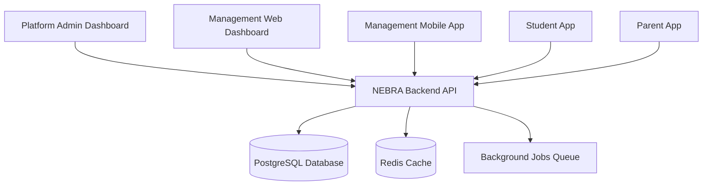

------------------------------------------------------------------------

# 2. Main Domains

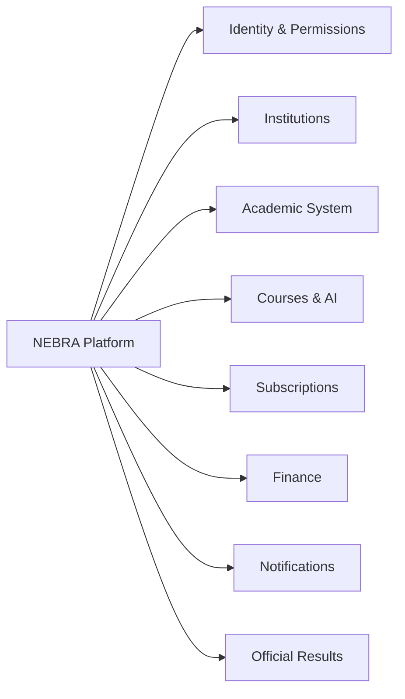

------------------------------------------------------------------------

# 3. Institution Structure

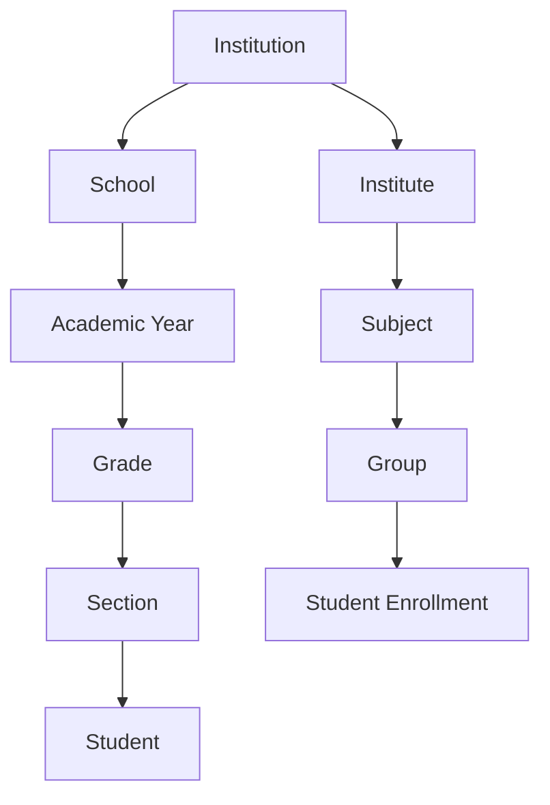

------------------------------------------------------------------------

# 4. User Roles Structure

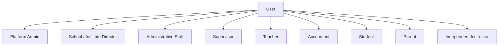

------------------------------------------------------------------------

# 5. Permission Scope

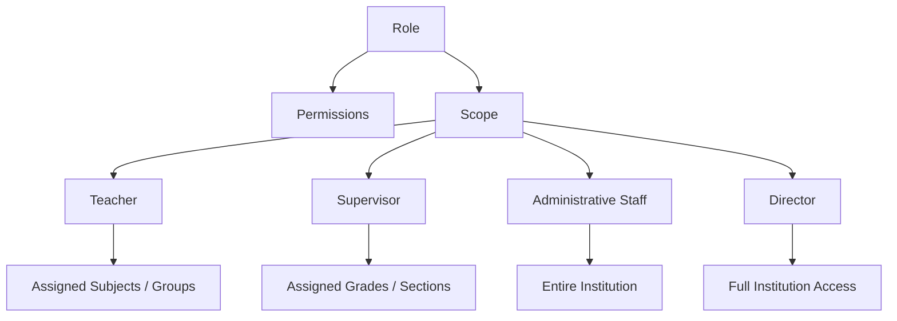

------------------------------------------------------------------------

# 6. Student Model

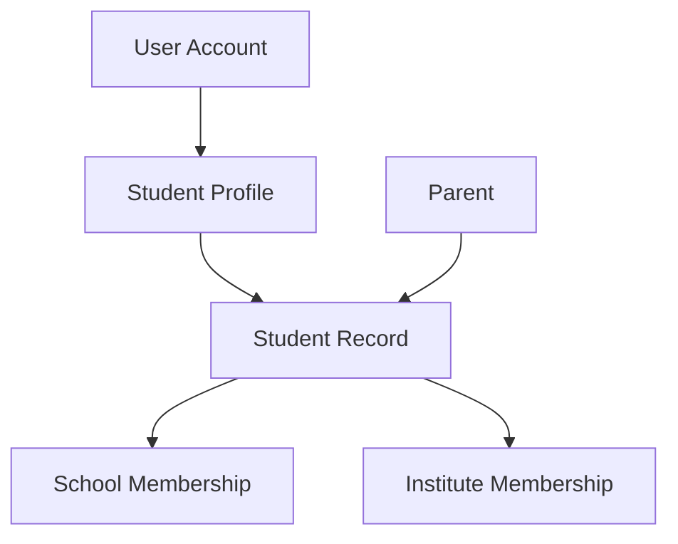

------------------------------------------------------------------------

# 7. Academic Exam Flow

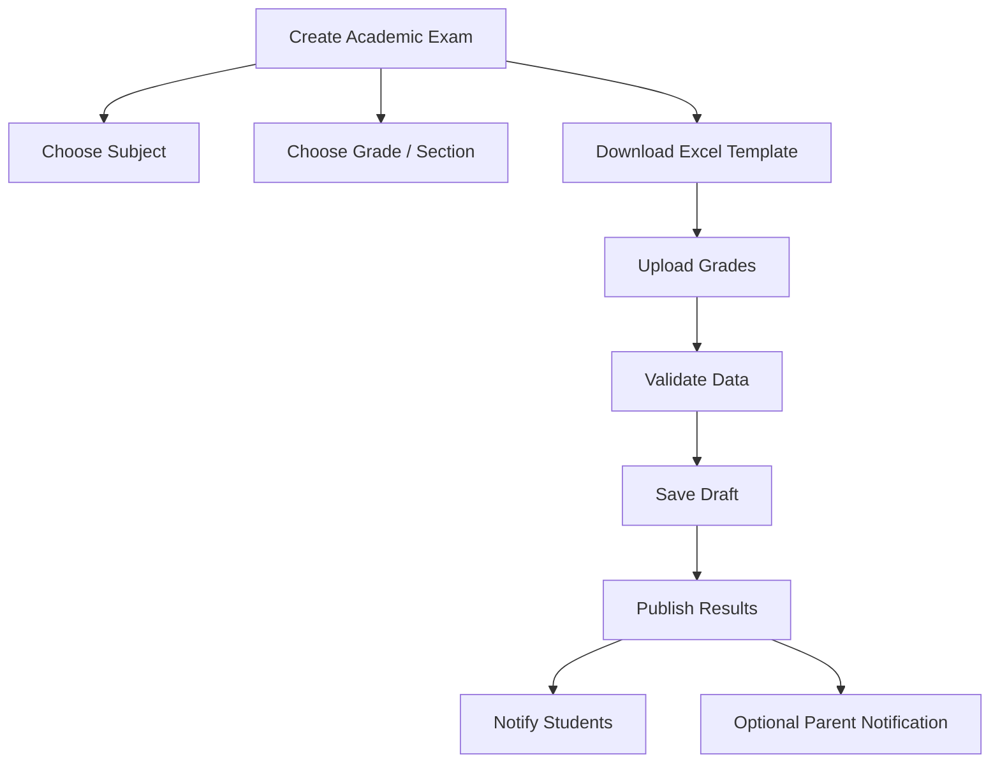

------------------------------------------------------------------------

# 8. Course & AI Flow

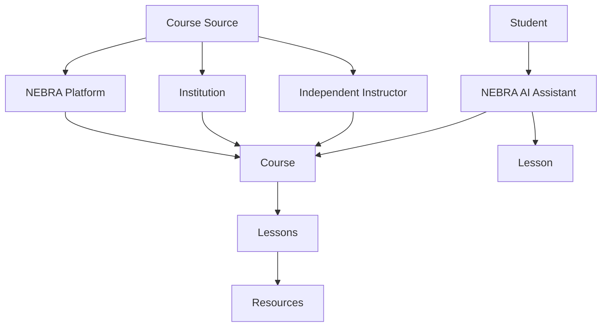

------------------------------------------------------------------------

# 9. Finance Flow

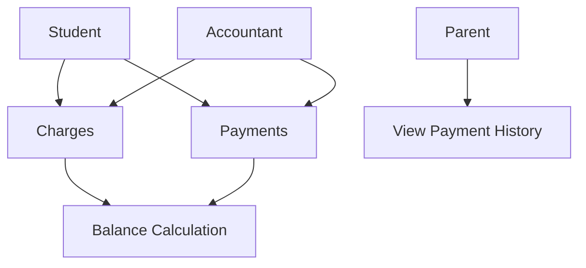

------------------------------------------------------------------------

# 10. Notification Flow

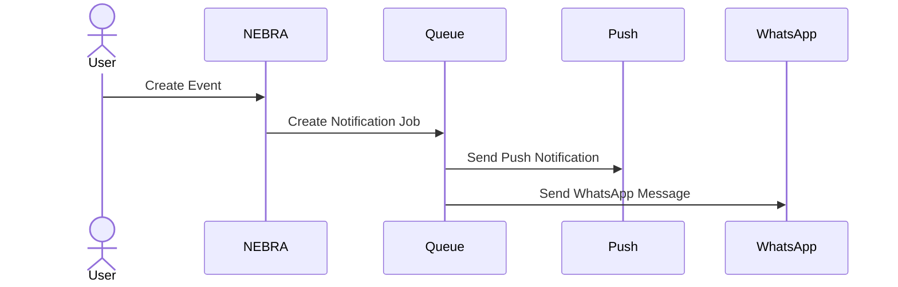

------------------------------------------------------------------------

# 11. NEBRA Development Phases

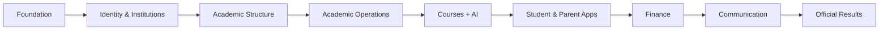

# Subscription Gating

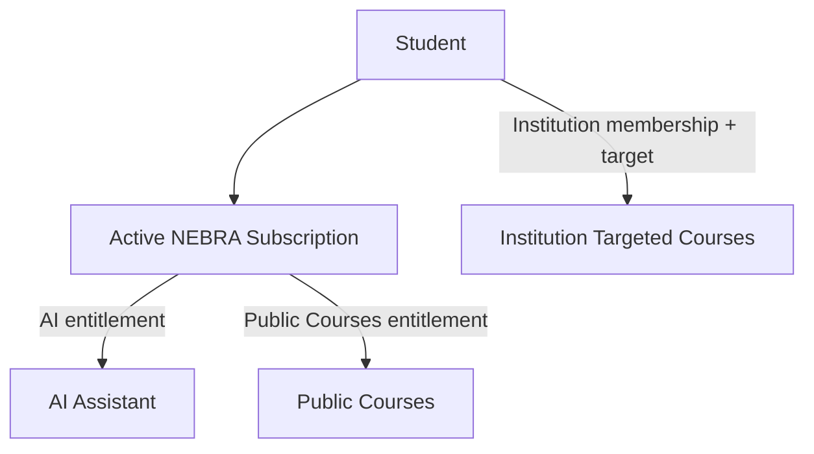
